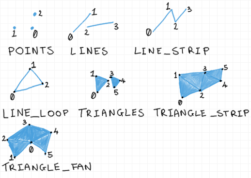

## Get Main OpenGL Library

If you are on Microsoft Windows, update your video drivers to automatically install the latest
library build for OpenGL to your system. This is a work in progress - check back later for updates.

If you are on Apple OS X then OpenGL is installed with operating system updates. You can find
out what version of OpenGL your system supports, as well as all of the OpenGL extensions
available to you, at [developer.apple.com/opengl/capabilities/](https://developer.apple.com/opengl/capabilities/).

If you are on GNU/Linux typically the Mesa open-source implementation of OpenGL is installed
by default. This should run on everything. It has enjoyed support from AMD and Intel in recent
years, and may provide you with a very modern high-performance and new implementation of OpenGL,
depending on your GPU. In the past you would typically switch to proprietary drivers to get an
up-to-date OpenGL version. This will still be the case for Nvidia GPUs. You can
install proprietary drivers cleanly in Ubuntu/Debian distributions by enabling "restricted drivers" in your software updater.

## Get Helper Libraries

To get started as quickly as possible, we are going to use a couple of helper libraries. OpenGL
really only provides an interface to the graphics driver, and even then it requires a bit of
messy set-up. OpenGL also doesn't know how to open a window on the operating system or accept keyboard
or mouse input. You can write all this functionality yourself without too much trouble by using your
operating system's libraries, but for now that's a bit of a distraction.
Let's use the following two libraries:

* GLEW - [glew.sourceforge.net](http://glew.sourceforge.net) - Makes sure we use the latest OpenGL headers available. Also handles OpenGL **extensions** (which
we don't need just yet).
* GLFW - [glfw.org](http://www.glfw.org) - Manages windows, starts up OpenGL, handles keyboard and mouse input, controls monitors/screens,
and provides many useful OpenGL-related functions.

The best way to get GLEW is to drop its source code directly into your project - download the
source code tarball or zip from the website and extract it into your project folder.

We will be using GLFW3. Most major Linux repositories should have a fairly recent GLFW3.
If you are on a GNU/Linux system you can install GLFW using your package manager. On Ubuntu or Debian:

```
sudo apt-get install glfw3-dev
```

On other systems you may use a different package manager with a similar package name.

If you are using Apple OS X it is most convenient to install GLFW using the Homebrew
[https://brew.sh](https://brew.sh/) package manager. Once you have Homebrew set up, from a terminal type:

```
brew install glfw3
```

It will be easier to link to your project when installed to your system like this, and can be cleanly
uninstalled with `brew uninstall glfw3`.

On Microsoft Windows you can download a compiled GLFW matching your compiler from the website.
You can also extract this download into your project folder. No installation is necessary.

If none of these approaches suit, or you don't have the necessary administration rights to install software,
then you may have to compile GLFW yourself from source code. First check if your course has
provided you with compiled files, or if GLFW is already installed on your lab system. If you
need to compile from source you will need to carefully follow the instructions on the GLFW
website. If you have not had experience compiling libraries before, or are not familiar with
the CMake build program then I would plan an extra few sessions to get the hang of this.

## OpenGL Program Skeleton

We can now build a complete sample OpenGL program. I think the easiest way to introduce this
in book form is in sections. Let's make a skeleton program with empty functions and fill in
the functions as we go. You will probably want to structure this to your tastes as you go.

```
// "Hello Triangle" OpenGL program in C99
#include <GL/glew.h>
#include <GLFW/glfw3.h>
#include <stdio.h>  // for printf()
#include <stdlib.h> // for exit()

void init_gl();
void create_geometry();
void create_shaders();
void draw_frame();

// dimensions for our window and a pointer to it
int win_width = 800;
int win_height = 600;
GLFWwindow *window;

int main() {
  init_gl();
  create_geometry();
  create_shaders();

  bool is_running = true;
  while ( is_running ) {
    draw_frame();
    is_running = false;
  }

  return 0;
}

void init_gl() {}
void create_geometry() {}
void create_shaders() {}
void draw_frame() {}
```

There are several distinct parts to a modern OpenGL program, as you can see.

* OpenGL initialisation and window creation.
* Defining data for 3D geometry to draw. We will copy this into buffers in graphics memory.
* Defining **shaders** - mini-programs that run on the GPU and define a style of rendering. These are
also copied to graphics memory, and we will have OpenGL compile and link them into shader "programs" like
a C program.
* Drawing in a loop, where we will also add code to respond to user input.
* Closing the window and program halt.

The following sections will describe each of these parts of the program. Let's fill in the `init_gl()`
function then try to compile and run what we have to make sure we have our build set up okay.

## Initialising OpenGL with Helper Libraries

Before we continue it's a good time to take stock of the computer's compiler tools - which IDE or compiler
are we going to use? I suggest you make and run a simple "Hello, world!" program first just to make sure
everything is working. You may need to install a compiler or other tools.

On GNU/Linux systems you will normally install a package of compiler and build tools. On Ubuntu-related
distributions this is `sudo apt-get install build-essential`. This will install the GNU C Compiler collection - GCC.
You can also install the Clang compiler, which shares the same interface. If you have a simple C program
in a file called `main.c` you can type `gcc main.c` to compile it into a program called `a.out`. Then
you can type `./a.out` to run it.

On Apple OS X, if you install the XCode IDE from the App Store then you also get the Clang compiler set.
You can then run a terminal and call `clang` to check that it is installed. If you have a simple C program
in a file called `main.c` you can type `clang main.c` to compile it into a program called `a.out`. Then
you can type `./a.out` to run it.

On Microsoft Windows you can download and install the free version of Visual Studio 2017, which can compile C99.
If you start an empty C project with a simple program in a file called `main.c` then you can compile and run it
from the Build and Debug menus. You can also compile with the Microsoft compiler from the command line, or install GCC or Clang,
but I think it's easier to start by using this IDE.

Okay, now that we have confirmed that we can compile something simple, we can flesh out our skeleton's initialisation
function, and we will try to compile and run that next.

```
// custom atexit() shutdown/cleanup function
void my_exit() { glfwTerminate(); }

// initialise OpenGL using GLFW and GLEW
void init_gl() {
  if ( !glfwInit() ) {
    printf( "ERROR: could not initialise GLFW\n" );
    exit( 1 );
  }

  // suggest GLFW start OpenGL 4.1 Core Profile - play around here
  glfwWindowHint( GLFW_CONTEXT_VERSION_MAJOR, 4 );
  glfwWindowHint( GLFW_CONTEXT_VERSION_MINOR, 1 );
  glfwWindowHint( GLFW_OPENGL_FORWARD_COMPAT, GL_TRUE );
  glfwWindowHint( GLFW_OPENGL_PROFILE, GLFW_OPENGL_CORE_PROFILE );

  // create a 800x600 window and OpenGL context with GLFW
  GLFWwindow *win = glfwCreateWindow( 800, 600, "My Window", NULL, NULL );
  if ( !win ) {
    printf( "ERROR: opening window/OpenGL context with GLFW\n" );
    glfwTerminate();
    exit( 1 );
  }
  // opengl functions we call now relate to this window+context
  glfwMakeContextCurrent( win );

  // from now on make sure the window is closed properly if we exit
  atexit( my_exit );

  // start GLEW to hook up OpenGL functions so we can call them
  glewExperimental = GL_TRUE;
  GLenum err = glewInit();
  if ( GLEW_OK != err ) {
    printf( "ERROR: could not start GLEW\n" );
    exit( 1 );
  }

  // ask OpenGL which version is running
  const GLubyte *renderer = glGetString( GL_RENDERER );
  const GLubyte *version = glGetString( GL_VERSION );
  printf( "renderer=%s\nOpenGL version=%s\n", renderer, version );
}
```

This is quite a lot of start-up code unfortunately, but let's explain each line.
You'll notice I snuck in an extra function up the top - `my_exit()`.
Once we've successfully opened a window using the GLFW library we
want to close this and other any resources whenever our program finishes.
You can do this manually, of course, but because I'm using `exit()` all over
the place I'm likely to forget. So about half way down the `gl_init()` function,
after successful window creation, I call `atexit()` with the new function, which
will then call my function and properly close the window whenever the program exits. 

The first instruction in `gl_init()` initialises GLFW. Following this we have a number
of "hint" functions to GLFW. These are gentle suggestions or requests that we would like
to start OpenGL with a particular version. Look up these hint functions in the GLFW documentation -
there's quite a large range of flags, and good explanations.  I'm asking for OpenGL 4.1 Core Forward-Compatible.
This is the newest version that is currently supported on Mac OS X, so it's a decent modern
OpenGL starting point across systems.

Depending on who wrote your graphics drivers, you
may end up having this hint ignored and always running the newest available version, or
specifically running this exact version and crashing if it isn't available. You should
experiment a little with this to see what you can run on your computer. This will depend on
the combination of GPU hardware, graphics driver version, and OpenGL implementation. Anything between
3.1 and 4.5 (the latest version at the time of writing) should be fairly similar for most
things we will do to begin with. You may need to adjust your technical documentation a little,
and choose slightly different versions of functions, but we will explain how to do that.

Avoid using older versions of OpenGL if you can, as the functionality
diverges a bit. It's possible to run older versions of OpenGL with extensions that make them
work to a modern standard to some degree, but we really don't want that distraction until we're
quite comfortable with everything else.

Some implementations of OpenGL support a lot of
functionality from older versions, flagged as "deprecated". If we ask for a "core, forward-compatible"
version of OpenGL it prevents us from using older functionality by accident, which is probably a
good idea for making your code more portable. You can find out what functions are available, but
flagged as deprecated in a particular version of OpenGL, by downloading the Quick Reference Card
- [opengl.org/documentation/](https://www.opengl.org/documentation/), which is colour-coded.

The following section of code asks GLFW to create a window for us, as well as starting an OpenGL
**context**, which is a running instance of OpenGL. If you can't run OpenGL based on the hints for
versions then this function should return a `NULL` pointer, and we can exit with an error message.
If this does work, we have a window with an OpenGL context. Before we can start calling OpenGL functions
we need to make this context "current" for us. You'll notice that the contexts and windows are tied
tightly together. Later, you should look up the `glfwCreateWindow()` function in the GLFW documentation,
and try making different sizes of window, or even full-screen rendering.

We can nearly start using OpenGL functions - we now ask the GLEW library to hook up the function pointers
in the OpenGL header to the actual function addresses, which is done with `glewInit()`. It may be necessary
to set `glewExperimental = GL_TRUE;` before initialising GLEW to get it to work properly with a core
profile of OpenGL on your system. Make sure that you intialise GLEW after creating the window and context with GLFW,
not before. When you get more advanced you can look at replacing GLEW with another, leaner, library, or your own code, but for now
I believe this is the easiest, most robust way to start that will work on any version of OpenGL.

Finally, we call some actual OpenGL functions - you can tell because they are prefixed with a little `gl...`.
This will print the version of OpenGL that has started to the terminal. You'll notice I'm using `GLubyte`
data types instead of `char`. OpenGL declares all its own common data types which are guaranteed to be
a big enough size for everything that OpenGL does with them. In reality they are usually just `typedef`
of the basic data types, so you can happily use those instead if you like. I usually use the OpenGL
data types to remind me that a variable is to be used with an OpenGL function.

## Compiling the Program

At this point we can run through compilation of the program so that we can test
that everything is working so far. The basic procedure is the same across all compilers and IDEs, but the
actual files used differ a little:

* Compile your source code files.
* Also compile `glew.c`.
* Add the include path for `GL/glew.h`.
* Add the include path for `GLFW/glfw3.h`.
* Add the linker path to GLFW's library.
* Link against GLFW's library.
* Link against OpenGL's library.

If you installed GLFW through the package manager on GNU/Linux then your compilation should look like:

```
gcc -std=c99 -o demo main.c ../glew-2.0.0/src/glew.c \
-I ../glew-2.0.0/include/ -lglfw -lGL
```
Where `-std=c99` indicates that it should compile as C99, `-o demo` means output an executable file called `demo`,
`../glew-2.0.0/` is the relative path to where I extracted GLEW. The "`\`" is just a line-break to make this easier
to read. `-I` means that the following path should be added to the header search paths. `-lglfw` links against `libglw.so`, and `-lGL`
links against the OpenGL library `libGL.so`. Note that I don't need to supply a linker path because everything is
installed to default system directories which are already on the library search path. I would then just run this
by typing `./demo`.

On Apple OS X, if you installed GLFW with Homebrew then you have a similar compile line:

```
clang -std=c99 -o demo main.c ./glew-2.0.0/src/glew.c \
-I ../glew-2.0.0/include/ -I /usr/local/include/ \
-L /usr/local/lib/ -lglfw -framework OpenGL
```

I didn't have the system include and library directory paths set up, so I explicitly add these with `-I` and `-L`, respectively, so that
clang can find GLFW's files. Note that the OpenGL library is a "framework" on OS X, which is a combination of header and library files in a bundle.

If you are using Visual Studio and are not very familiar with the project settings menus you may find it helpful
to watch the video listed on this book's web page ( TODO - work in progress ). I believe a video will work better than static images here, and they are easier
to update when software changes. You will find this on [antongerdelan.net/opengl/](https://antongerdelan.net/opengl/). The summary is that
you need to be careful to use the versions of GLFW's `.lib` and `.dll` files matching your compiler and build (32-bit or 64-bit), add your search paths to the right
menus, add `glfw3.lib` and `opengl32.lib` to the project's linking field (yes, the library is called `opengl32`, even on 64-bit builds),
and move the `.dll` file to the correct working directly when you run your `.exe`.

If I run this on my Mac Mini I get:

```
bash-3.2$ ./demo
renderer=Intel HD Graphics 5000 OpenGL Engine
OpenGL version=4.1 INTEL-10.22.29
bash-3.2$
```

Which tells me which graphics device is doing the rendering, and that I successfully started an OpenGL 4.1 context.

If you have gotten this far, you're over probably the biggest frustration of getting started, so now we can get back to the fun parts,
and fill out the next function. It's probably wise to save a folder with a copy of your basic build so that you can use it as a starting point later.

## Creating Geometry

3D geometry - meshes - in OpenGL are defined by a series of point coordinates in 3D space.
Modern GPU hardware is only set up to draw triangles. You can also draw points that can be scaled up to a custom size in pixels.
There are some vestigial functions to draw lines and other shapes, but they aren't very reliable, so it's best to
construct everything out of triangles or points.
How do you define a 3D triangle? Easy - a set of three 3D coordinates. In geometry
we call a corner point a **vertex**, plural *vertices* or *vertexes*. If you want to
describe a surface made from several triangles you have a few options actually.
Available drawing modes are
given in Figure~\ref{fig:draw_modes}. You can see that if you give the same
buffer of points, but indicate a different drawing mode that you can get quite
different results.

{#id .class width=100%}

The order that you supply the vertices determines which side of the triangle is considered the front, and which side is
considered the back. Generally, a counter-clockwise **winding** order indicates the front-facing side of a triangle, but
you can swap this convention globally in OpenGL, if you like. Just remember to keep your point order consistent.

After we finalise the position values of each vertex, it will be converted by OpenGL into a 3D coordinate space called
**normalised device space**, which has dimensions -1 to 1 on X, Y, and Z axes in OpenGL.
This is a cube or box. Everything outside this
volume is considered not in the view area, and will have been automatically **clipped**. We will get back to the details of
coordinate spaces later when we do transformations, but with this -1 to 1 range in mind, 
where a coordinate with values (0, 0, 0) on X, Y, and Z, respectively will be
in the middle of the view volume. Based on this We can determine some 3D
points for a triangle so that it appears exactly covering our window area.
We will leave all the Z coordinates at 0 for now.

{#id .class width=100%}

TODO DIAGRAM OF A TRIANGLE WITHIN VIEW VOLUME

Figure ~\ref{fig:first_triangle} gives us an example of coordinates we might
use to display a triangle covering our window.
All we have to do is have a simple array of these `float` values containing these points. We can give the components
one after the other, so that our array contains X,Y,Z,X,Y,Z,X,Y,Z - 9 values.

### Vertex Buffer Objects

In order to draw using this set of vertices we copy our array into a **vertex buffer**, which means copying them into
graphics memory. Most dedicated desktop GPUs have their own memory, in the order
of gigabytes. Older versions of OpenGL would have us feed
the points in every time that we draw a mesh - not so any more. We keep the vertex buffers in graphics memory, and just tell OpenGL
which buffer(s) to use before drawing.

```
GLuint triangle_vao;

void create_geometry() {
  // copy our data into vertex buffer objects (into graphics memory)
  float triangle_points[] = { -1, -1, 0, 0, 1, 0, 1, -1, 0  };
  GLuint vertex_buffer_object; // a "VBO"
  glGenBuffers( 1, &vertex_buffer_object );
  glBindBuffer( GL_ARRAY_BUFFER, vertex_buffer_object );
  glBufferData( GL_ARRAY_BUFFER, sizeof(float) * 9, triangle_points, GL_STATIC_DRAW );
  
  // VAO tells our shaders how to match up data from buffer to shadre input variables
  glGenVertexArrays( 1, triangle_vao );
  glBindVertexArray( triangle_vao );
  glEnableVertexAttribArray( 0 );
  glBindBuffer( GL_ARRAY_BUFFER, vertex_buffer_object );
  glVertexAttribPointer( 0, 3, GL_FLOAT, GL_FALSE, 0, NULL );
}
```

We need to keep track of a variable here for subsequent functions, so I've just
made it a global - `GLuint triangle_vao`. `GLuint` is OpenGL's `unsigned int`
type definition. There are two parts to this function:

* Copying our triangle data into an OpenGL buffer.
* Creating something called a **vertex array object** (VAO) to describe the data.

I have put our triangle's 3D points into an array of `float` variables. That's
fine. The next step is to ask OpenGL to create a buffer. Buffers of vertex data
in OpenGL are called **vertex buffer objects** (VBOs). Note that "object" here does
not imply object oriented programming. It just means that it's a distinct OpenGL
variable that we can refer to using a handle or unique integer ID. We see a
pattern here that repeats in a lot of OpenGL interface code:

1. `glGen...()` - Give us a unique index/ID/key for a new OpenGL variable.
2. `glBind...()` - Globally "bind" an object as the current object. All
subsequent related operations will work with this object, and not any other, until
we bind another object.
3. `glBufferData()` - Copy data into the currently bound object.

So we see a strange part of OpenGL's API design - it uses a **global state machine**
or global binding model. This is very different to object oriented programming
where state is encapsulated in objects. This is going to cause you a lot of
headaches and bugs if you do not make it clear to yourself what the currently
bound states are. Keep this in mind - we will discuss some strategies
for dealing with this, and some alternative functions, at the end of the chapter.

You should look up every function that you use in OpenGL documentation. The Quick
Reference Card doesn't provide much explanation, and the official specification
can be a little too technical. Let me suggest an excellent third-party resource:
[docs.gl](http://docs.gl), which refines the existing API guides in a nice,
dynamic website. You can enter any OpenGL function, where you should
look for:

* What the parameters and return type mean.
* Which versions of OpenGL support this function.
* If the function depends on any enabled or bound states.
* If there are any alternative functions that do the same job.

You can even find example code snippets for lots of commonly used functions.
In particular, note that `glBufferData()` is asking for:

* The type of buffer it is - `GL_ARRAY_BUFFER`.
* The size (in bytes) of the data to copy in.
* The address to copy from main memory.
* If the buffer is likely to be updated once or more frequently. We we will
just update this buffer this one time, so we flag this as `GL_STATIC_DRAW`.

### Vertex Array Objects

The second half of the `create_geometry()` function looks very similar to the
first, but we are creating a different type of OpenGL variable - a VAO, or
**vertex array object**. OpenGL concepts are not very clearly named, I'm afraid,
and this may be the most ambiguous name of the lot. The VAO is a relatively new
concept - it actually reduces the amount of global state that we need to enable
for each mesh or piece of geometry that we want to draw. Its role is to map the
data from our buffers to shader input variables, called **vertex specification**.
You must have a VAO bound before you can draw, or your program will crash.
Some implementations won't let you use a shader program without a bound VAO,
so it's a good idea to do this now.

We create a vertex array object called
`triangle_vao`, and enable one input variable with `glEnableVertexAttribArray( 0 )`.
Input variables to the vertex shader are also known as **attributes**. We bind
the buffer that we will tell it to fetch data from with `glBindBuffer()`. Actually
this buffer was already bound, so this particular call is redundant, but it's
useful as a placeholder. If you make VAO creation a separate function you should
be careful to bind the buffer explicitly.

Look up the next function - `glVertexAttribPointer()`
on docs.gl. It sets up an attribute's data mapping to a buffer and stores that
in the currently
bound VAO. It therefore depends on the currently bound VAO *and* the currently
bound VBO. The specification for the functions is:

```
void glVertexAttribPointer(	GLuint index,
                            GLint size,
                            GLenum type,
                            GLboolean normalized,
                            GLsizei stride,
                            const GLvoid * pointer );
```

* The first parameter says which attribute or input variable we are
describing the data for - number 0.
* The second parameter says how many components our attribute has.
It's 3 because the input point is a *XYZ* 3D position, made from every 3
`float` values.
* The `type` parameter asks us what data type to expect. There is a distinct
list of data types available for the function. We have `float` so we will use
the matching `GL_FLOAT`.
* The next parameter asks if the data should be normalised - the
answer will almost always be no, or `GL_FALSE`.
* The last two parameters, `stride` and `offset` allow us to say if there are
bytes in the buffer in-between our attribute data, and if the data starts
offset from the front of the buffer. This allows us to pack more than one
attribute's data into a single buffer, and interleave the attribute data if we
want. We don't have that situation yet so we can leave the stride field as `0`,
and the final parameter can be left as `NULL`,

TODO diagram explaining VAO's state data

The take-away for the `glVertexAttribPointer()` and `glEnableAttribArray()` functions
is that we are setting up the input variables we need for drawing by mapping to data we
coped into buffer(s), and that this information is stored in the bound VAO.

When we bind the VAO later all of this attribute mapping and setup information
will be remembered. There are different ways to treat these things, but I
generally create one unique VAO variable for every unique
mesh in my program, which is a common approach.
When I want to draw an instances of that mesh I will bind
the VAO once and draw all the mesh instances in a loop. You don't need to
re-bind the buffers (VBOs) or set up the `glVertexAttribPointer` later.

At this point it is a good opportunity to get
the PDF of the official OpenGL Specification document for your version of OpenGL
from [opengl.org/documentation/](https://www.opengl.org/documentation/).
This is not very good as an instruction manual/tutorial, as you will see,
but is the ultimate reference for double-checking exact details of
functionality. Look up the section for
Vertex Array Object, and also see if you can find the tables (23.2 and 23.3 on page
560-561 for the core OpenGL 4.5 Specification, at the time of writing)
listing which states are stored in a VAO. You may recognise several of the
parameters which we have just set.

The VAO is one of the more confusing concepts in OpenGL, so a good moment to
introduce a typical reference process for the future:

1. Find the function and related functions on the Quick Reference Card.
2. Look up the function details on docs.gl.
3. For deeper insight look up the function in the OpenGL Specification.
4. You can also find additional practical information and tips for concepts and functions on the OpenGL wiki: [khronos.org/opengl/wiki/](https://www.khronos.org/opengl/wiki/).
5. Don't forget to ask good questions from more experienced programmers - there are often hidden catches or alternatives.

## Creating Shaders

TODO revise based on new introduction to shaders at the start. (or revise that)

A shader **program** combines all shader stages used in one run through the
rendering pipeline, and determines a style of rendering. You can switch between
shader programs to draw geometry in a different style. In modern, core OpenGL
you must have a shader program before you can draw anything. A minimal shader
program comprises a vertex shader and a fragment shader, which is what we will
write.

Our vertex shader will be invoked for each of our 3D points, so we
write it such that it can position any point correctly. Each invocation will be
given different input data from our buffer. Note that this stage is not
affected by the screen or window resolution.

Our fragment shader will be invoked for each pixel-sized fragment our rasterised
triangle covers. If our window or screen resolution increases, the number of
fragments covered by our geometry does too, as our triangle will scale up.

TODO pipeline picture with compute shaders
TODO or move this info up to the intro - it's a bit off topic
 
```
GLuint shader_program;

void create_shaders() {
  const char* vertex_shader_str = "#version 410 core\n \
  layout( location = 0 ) in vec3 vert_pos;\n \
  void main(){\n \
    gl_Position = vec4( vert_pos, 1.0 );\n \
  }";

  const char* frag_shader_str = "#version 410 core\n \
  out vec4 frag_colour;\n \
  void main(){\n \
    frag_colour = vec4( 1.0, 0.7, 0.4, 1.0 );\n \
  }";
  
  // compile the vertex shader
  GLuint vert_shader = glCreateShader( GL_VERTEX_SHADER );
  glShaderSource( vert_shader, 1, &vert_shader_str, NULL );
  glCompileShader( vert_shader );
  int params = -1;
  glGetShaderiv( vert_shader, GL_COMPILE_STATUS, &params );
  if ( GL_TRUE != params ) {
    fprintf(stderr, "ERROR: GL shader index %i did not compile\n", vert_shader);
    _print_shader_info_log( vert_shader );
    return 1; // or exit or something
  }
  
  // compile the fragment shader
  GLuint frag_shader = glCreateShader( GL_FRAGMENT_SHADER );
  glShaderSource( frag_shader, 1, &frag_shader_str, NULL );
  glCompileShader( frag_shader );
  params = -1;
  glGetShaderiv( frag_shader, GL_COMPILE_STATUS, &params );
  if ( GL_TRUE != params ) {
    fprintf(stderr, "ERROR: GL shader index %i did not compile\n", frag_shader);
    _print_shader_info_log( frag_shader );
    return 1; // or exit or something
  }
  
  // link both stages into a shader program
  shader_program = glCreateProgram();
  glAttachShader( shader_program, vert_shader );
  glAttachShader( shader_program, frag_shader );
  // NOTE: [optional] bind attributes in here
  glLinkProgram( shader_program );
  params = -1;
  glGetProgramiv( shader_program, GL_LINK_STATUS, &params );
  if (GL_TRUE != params) {
    fprintf(stderr,
      "ERROR: could not link shader programme GL index %u\n",
      shader_program);
    _print_program_info_log( shader_program );
    return 1;
  }
```

I've created another global variable to let you know what you need to keep
track of for use later, when we are drawing. This our our shader program that
we will build from a vertex shader and a fragment shader.

The first thing you may find surprising is that the shaders are just written in
C strings. You'll also notice that shaders are
almost identical to C programs. Later, you will find it convenient to store your shaders in
ASCII text files, and read them into strings with a little function. Note that
the `\` is allowing me to continue the string on the next line. The `\n` is
an actual line-break in the shader code. You need one of these on the first
line because it doesn't end in a semi-colon.

At the top of each shader we must specify a `#version` number. If you forget your driver will
probably compile these in the earliest shader version that it knows, which is
not going to help you. The version is actually the version of the **GLSL** (OpenGL
Shader Language) that the shader is written against, which differs a little from the
OpenGL version. I also added a `core` tag to indicate that I'm not intending to
use compatibility with older versions. The following table gives some version
tag values against equivalent versions of OpenGL. You can modify the version
number in the shaders to match the version of OpenGL that you are running.
You driver's shader compiler may actually support several different shader
versions but it's a good idea to stick with the same version as your OpenGL
version so it's more likely to run properly on other computers, which have
different drivers.

| OpenGL Version | GLSL Version | `#version` tag |
| -------------- | ------------ | -------------- |
| 4.5            | 4.50         | 450            |
| 4.4            | 4.40         | 440            |
| 4.3            | 4.30.8       | 430            |
| 4.2            | 4.20.11      | 420            |
| 4.1            | 4.10.6       | 410            |
| 4.0            | 4.00.9       | 400            |
| 3.3            | 3.30.6       | 330            |
| 3.2            | 1.50.11      | 150            |
| 3.1            | 1.40.08      | 140            |
| 3.0            | 1.30.10      | 130            |
| 2.1            | 1.20.8       | 120            |
| 2.0            | 1.10.59      | 110            |

The second line in the vertex shader `layout( location = 0 ) in vec3 vert_pos;`
defines an input attribute. When we draw this will fetch an instance of our
vertex data based on whatever the currently bound VAO is when we draw. The VAO
that we set up earlier sets up attribute number 0, which is reflected here in
the `layout( location = 0 )` tag. The `in` keyword indicates that this is an
input attribute. In older versions of GLSL this keyword appears as `attribute`
rather. Remember that we enabled attribute number 0, and also set up an
attribute pointer to 3 `float`s in our buffer for attribute number 0.
The 3 `float` maps to the `vec3` data type that we see here. GLSL has a number
of built-in vector and matrix types in addition to all the basic types from C.
Finally `vert_pos` is the name of the variable. You can use anything you like
here.

The instructions for a shader are inside a C-style function called `main()`.
We only have one instruction in our vertex shader - a built-in GLSL variable
called `gl_Position` is set. You should look up the built-in GLSL variables and
functions list on the Quick Reference Card for your version of OpenGL/GLSL.
Each shader stage has a few unique built-in variables, prefixed with `gl_`.
Here, you will see that `gl_Position` has the data type of `vec4` - a vector
with 4 `float` components. Our vertex shader is required to set the value of
this variable - this is the final position of the vertex. In the next chapter
we will modify the vertex shader to apply some animation first, but here we
we just pass through the original value as the output. Why does the output have
4 components when our vertex position is a 3D coordinate? The answer is that
the fourth component isn't really a fourth geometric dimension, it holds a
special value which OpenGL will use after the vertex shader to compute
perspective. We will make use of this when we build virtual cameras later, but
for now let's leave it as value 1.0. You'll notice that GLSL has constructor
functions for creating its special data types, similar to what you might use
in C++. We are just using this to create a `vec4` from a `vec3`. The XYZ
components from our position are used for the first three components of the
`vec4`, and the remaining `1.0` is used as the fourth component. These
functions are quite flexible, which we will also experiment with in the next
chapter.

The fragment shader string is very similar to the vertex shader. It has an
`out` keyword rather than an `in` keyword. In older versions of GLSL this was
another built in variable called `gl_FragColor`, but now we have to define
our own. The output here is a 4-channel colour for our fragment. There is one
channel for red, green, blue, and alpha, respectively. The values for each
channel are expressed as `float`s between 0.0 and 1.0. You might be used to
setting similar colour values in HTML in hex notation, or in the range 0-255.
This is the same idea, but you'll have to do a little bit of mathematics to
convert to this notation. The alpha channel can be used for a variety of
special effects, but is most commonly used to indicate opacity - a kind of
faked semi-transparent effect. It does nothing by default, so we can leave it
as 1.0. Once you get this program working you should play around with changing
the colour values here, to see if you understand how it works.

Both shader strings must be copied to graphics memory, and compiled into
shaders. Each shader is referred to with a familiar `GLuint` handle or unique
number, which we get when we call `glCreateShader()`. Note that we have to tell
the function what type of shader we are creating. We have a `GL_FRAGMENT_SHADER`
and a `GL_VERTEX_SHADER`. Don't mix these up, or you will get very confusing
error messages! The `glShaderSource()` function copies your shader string into
graphics memory. This function is actually set up to take an array of strings
as its third argument, but I store the source in a single string, which is why
I'm giving it a `1`, and the address of a pointer, as the second and third
arguments, respectively. The final parameter can be used to indicate the length
of each string, but it's okay to leave this as `NULL`.

The `glCompileShader()`
function processes our shader code, and this is where we may find errors pop
up. It's really easy to make a typo, small error, or discover a reason another
computer's shader compiler doesn't like your shader. If this happens OpenGL
will have stored error messages in an internal log, which we can check for and
print out. Note that the errors found and reported differ considerably
depending on which implementation of OpenGL you are using. This is a major
weakness of GLSL shaders - you get different bugs on different computers. This
means you need to do a lot of testing on different machines to make sure that
your shaders are robust. `glGetShaderiv()` checks the compilation status of
your shader. If the value set in `params` is not equal to `GL_TRUE` then you
have an error compiling your shader, and we can check the internal logs.

You will notice that I added a call to a helper function, which prints
out any errors or typos that prevented the shader from compiling. You can
add this and define it above your shader creation function.
Make sure that you read the terminal output of this function when you run the program.
If your geometry appears completely white at some point it's
probably an indication that there was an error in your shader and OpenGL is
rendering it in a fall-back without using a shader. This is when you will check
your logs.

```
void _print_shader_info_log( GLuint shader_index ) {
  int max_length = 2048;
  int actual_length = 0;
  char shader_log[2048];
  glGetShaderInfoLog( shader_index, max_length, &actual_length, shader_log );
  printf( "shader info log for GL index %u:\n%s\n", shader_index, shader_log );
}
```
All we are doing here is copying the log into a string using `glGetShaderInfoLog()`,
and printing it out. Remember to quickly look up all of these functions on
docs.gl to double-check you know what all the parameters mean.

Creating the shader program from the compiled shaders uses very similar code.
We create a shader program, giving us another `GLuint` - which I made a global
variable. After this we can attach all of our shaders to it using
`glAttachShader()`. We then need to finalise our program by calling
`glLinkProgram()`. You may also encounter errors here. If you mix up the types
of shader being attached, or have outputs from one shader stage mismatching
inputs to another stage (we aren't using this feature yet) then you will have
errors reported here. We can write another helper function to print the linker
log if `glGetProgramiv()` reports a failed link status:

```
void _print_program_info_log( GLuint programme ) {
  int max_length = 2048;
  int actual_length = 0;
  char program_log[2048];
  glGetProgramInfoLog( programme, max_length, &actual_length, program_log );
  printf( "program info log for GL index %u:\n%s", programme, program_log );
}
```

`glGetProgramInfoLog()` has the same format as the shader log function. We
should now have enough components to write the function that actually draws
our triangle. Quite a lot to learn for getting started, I know! Try compiling
the program now to make sure there were no mistakes.

## Drawing a Frame of Rendering

A typical drawing loop will:

* Clear the framebuffer.
* Bind (make current) a VAO - *what* to draw.
* Use (make current) a shader program - *how* to draw.
* Draw all items using the above VAO and shader program.
* Swap the framebuffer we have been drawing on with the displayed framebuffer.

In the next chapter we will discuss some additional steps to let us draw
multiple copies of our triangle in different locations. For now we will just
have one draw call.

```
void draw_frame() {
  glClear( GL_FRAMEBUFFER_COLOR_BIT ); // check this TODO
  
  glBindVertexArray( ... ); // details TODO
  glUseProgram( shader_program ); // and here
  
  glDrawArrays( GL_TRIANGLES, 0, 3 );
  
  glfwSwapBuffers( &window ); // TODO check details
}
```

TODO mention colour to clear to, and also the clear depth bit?

TODO binding the vertex array

TODO useprogram

TODO draw arrays - primitive styles.

TODO swap buffers - from GLFW. similar commands in SDL, GLUT, etc.

## Things to Try

* Load your shaders from two separate plain text files, rather than hard-coded
strings. Then you won't need to recompile the program after changing your
shaders.
* Make your triangle twice as big, and twice as small on screen.
* Change the fourth parameter to `gl_Position` to `0.5` and `2.0`. What happens? We will discuss this in the next chapter.
* Changing the colour of the triangle in the fragment shader. If you want a
colour picker that write to that range of numbers I have one on my website
[antongerdelan.net/colour/](https://antongerdelan.net/colour).
* Change the background clear colour. Hint: search for a function starting with
`glClear...` in docs.gl.
* Try rendering with points and lines modes instead of triangles.
* Modify the input data so that we have a square, made from two triangles.
You will have to change the size of the vertex buffer, as well as the number of
points drawn.
* Write shader error logs to a file for post-crash debugging.
* Try different window sizes in initialisation.
* Error callback.
* Hot-reloading shaders or in the next chapter?

## Common Problems

* createarrays not defined - using old gl.h. GLEW experimental. not manually
including gl.h. glew.h included before GLFW. System has newer OpenGL - does the
hardware support it? can you run a game or demo program. Are drivers set up correctly?
* triangle appears white - shader compilation failed. check version tags at
top of shader match OpenGL version. read the logs output to the terminal.
* vao not defined before creating shaders (apple)
* mixing up params to attrib functions
* assigning your own object id
* incorrect number of vertices to glDrawArrays()
* hard to tell - lots of small functions in program. use a debugger to step
through.

## Dealing with Global State

* bind and unbind
* alternatives to glgen...

TODO table of version comparisons with glGen... vs glCreate...

## Advanced Alternatives

* TODO - read this. "use programmable pulling" --> chapter in OpenGL Insights instead of vao/pointers etc. ???
* function alternatives:

Functions replacing the old `glGen`, `glBind` model with a newer `glCreate` (as used in our shaders).
These are consistent with the interface used for shaders, and are guaranteed to store default state in the
created object. This enables the use of corresponding direct state access functions, which are pretty neat.
Here a few that we might consider using:

| Older             | Newer                   | Version Required |
| ----------------- | ----------------------- | ---------------- |
| glGenBuffers      | glCreateBuffers         | 4.5              |
| glGenVertexArrays | glCreateVertexArrays    | 4.5              |
| glGenFramebuffers | glCreateFramebuffers    | 4.5              |
| glGenTextures     | glCreateTextures        | 4.5              |

Direct state access (DSA) functions allow us to avoid the binding model, which is a relief. Unfortunately they are
available in only the very latest core versions of the API.
The DSA versions of functions take the buffer or texture
as a "named" parameter to the function, rather than needing it to be bound first.
You might try replacing the call to `glBufferData` and the `glBindBuffer` above it with `glNamedBufferData`.
Here are some that you might use as alternatives in this book:

| Older                    | DSA Alternative               | Version Required | 
| ------------------------ | ----------------------------- | ---------------- | 
| glBufferData             | glNamedBufferData             | 4.5              |
| glBufferStorage (4.4)    | glNamedBufferStorage          | 4.5              | 
| glClearFramebuffer       | glClearNamedFramebuffer       | 4.5              | 
| glCheckFramebufferStatus | glCheckNamedFramebufferStatus | 4.5              | 
| glFramebufferTexture     | glNamedFramebufferTexture     | 4.5              | 
| glGenerateMipmap         | glGenerateTextureMipmap       | 4.5              |
| glTexStorage             | glTexturesStorage             | 4.5              |  
| glUniform...             | glProgramUniform...           | 4.1              |

Now we've gotten familiar with the old binding model, which we still need to know about,
have a demo that works on all the major desktop platforms, and know how to upgrade it
to the very latest interface conventions.

//   uniform->programuniform 4.1 <--------------------------------__YES! this should
//   fix some bugs to be
//
// glVertexAttribPointer()  can go to glBindVertexBuffers 4.4 and/or
// glVertexAttribFormat 4.3
// gets rid of pointer stuff

## Alternative Libraries
